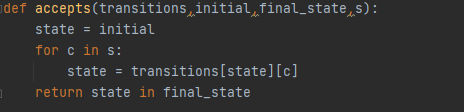
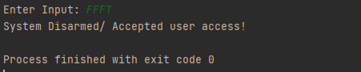
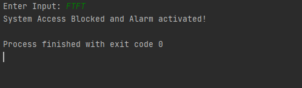

Name: Muhammad Hakeem Adli Bin Abdul Rahim 

ID: 1817151 (Section 2)

## **Challenge 1: Smart Home Security System (SHOSEM)**

#### **Brief Information:**

This a system which based on my group project for Computer Architecture class where we are supposed to build a system for a household that will prevent any breaches from happening. This consist of three main sensors,

1. **Motion Sensor ** - it will detect any movement in secured areas, and it will capture the person activity.

2. **Door lock sensor** – if the sensor was not intact or broken it will activate the system alarm.

3. **Breach sensor** – it is a sensor for an area that is not covered by other main security sensor such as windows or another accessible door (sliding door).

4. **Owner authorizations**- owner can disable/disarm the security system by entering their registered passcode.

#### **State Transition Table**

#### **State Transition Diagram**

##### L = {FFFT}

## Challenge 2 : Codes State Transition into into Python

#### Introduction

​	This is  the implementation of Deterministic Finite Automata state transition diagram was done in Python 3.

#### Explanation

#### Acceptance

This part of code was about step through the string character by character, and at each step simply look up the next state. When it is done stepping through each of the string it simply check if the final state is in the set of accepting states.

#### State Transitional diagram implementation

Based on challenge 1 State Transition diagram below is the implementation in list form for Python,

#### Running the program

As shown below, the TestDFA() function was for calling the accepts() functions to check whether the input 's' is acceptable or not,

#### Result

Below is the acceptable input for the system which is FFFT which allow the system to be disarm in perspective of the project.

Meanwhile, for the rejected result which causing the system alarm will be activated.

this one of the input will be resulting the system security alarm will be activated among other combinations.
